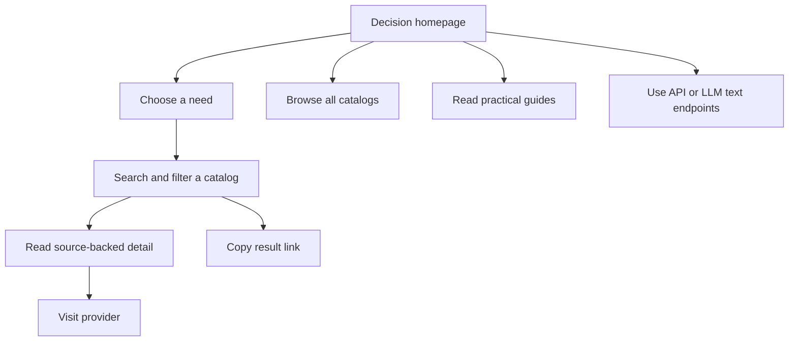

# Redesign: decision-led catalog

Status: Wave 1 implementation in progress

## Motivation

Freestack already records the details that decide whether a free tool is usable: limits, eligibility, commercial permissions, and alternatives. The old homepage made visitors understand the directory before reaching those facts. This redesign starts from the visitor's project and gives them a short route into the right catalog section.

The product's useful mechanism is structured comparison with hard numbers and practical “pick this if” guidance. It is a decision catalog, not a provider ranking engine.

## Audience and use scene

The primary visitor is a student or early-career developer choosing infrastructure for a real project on a tight budget. They know what they are building, but need help finding the provider terms that matter. Small teams also use Freestack to compare limits before adopting a service.

## Shipped in Wave 1

- The homepage leads with the choice task and six category starting points.
- The catalog directory remains available and keeps its dense, row-based presentation.
- Catalog, category, search, and commercial filters are represented in the URL.
- A visitor can copy the current result URL. No result ranking or fit explanation is claimed.
- SaaS, APIs, and LLM & AI remain independently browsable.

## Information architecture

The main path is homepage → need preset → filtered catalog → detail page → provider. Browsing the full catalogs remains one click away.

## Homepage starting points

The six links open category filters backed by existing catalog categories:

- Host a web app — SaaS / Hosting
- Store data — SaaS / Databases
- Add authentication — SaaS / Auth & secrets
- Send email — SaaS / Email & forms
- Use a public API — APIs / Weather
- Run AI — LLM & AI / Inference

These are navigation shortcuts. They do not rank providers or guarantee a fit.

## Visual direction

Use a restrained technical decision desk: near-black surfaces, warm sand as the single accent, sans-serif explanations, and mono type for limits and labels. Use hairlines and dense tables where facts matter. Keep catalog results as rows so limits and terms stay scannable.

Avoid unsupported scoring, decorative dashboard cards, gradients, and claims that imply a provider has been independently benchmarked. See [`../DESIGN.md`](../DESIGN.md) for the implemented tokens and component rules.

## Follow-up work

These remain proposals. They are not part of the Wave 1 behavior:

1. Add a three-entry compare view driven only by catalog fields.
2. Explain exclusions by naming the exact filter field that removed an entry.
3. Add freshness and correction fields only after agreeing on data ownership and verification rules.
4. Add analytics only with a privacy and retention decision.
5. Add saved comparisons only if users need persistence beyond shareable URLs.

## Success checks

For this release, verify that a visitor can reach each starting category, combine filters, reopen the resulting URL, inspect an entry, and navigate to its provider. No usage metrics are claimed until product analytics exist.

## Scope and source of truth

[`SPEC.md`](../SPEC.md) defines the release contract. [`PRODUCT.md`](../PRODUCT.md) records durable product truth. This document explains the redesign and marks follow-up ideas as proposals.
