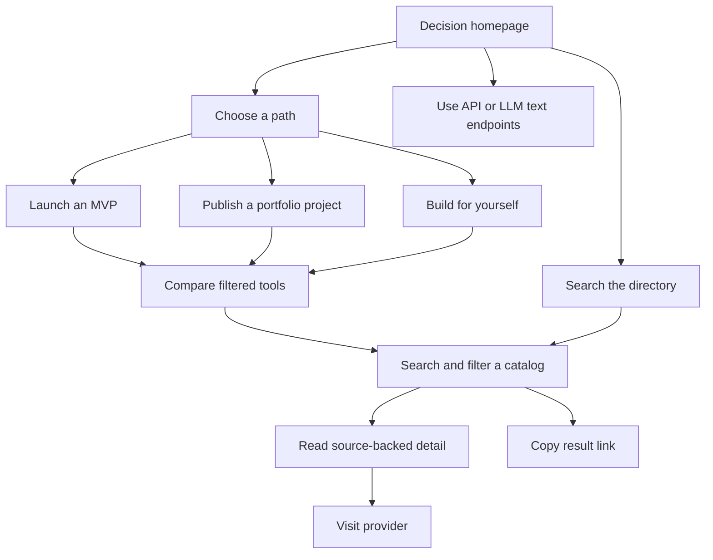

# Redesign: decision-led catalog

Status: Audience paths and guides implemented locally; ready for review

## Motivation

Freestack already records details that decide whether a free tool is usable: limits, eligibility, commercial permissions, and alternatives. The redesign starts from the visitor's project and gives them a short route into the right guide and catalog section. Its motivation is to help people ship within real constraints, avoid cost and policy surprises, and make their work useful to others.

The product's useful mechanism is structured comparison with hard numbers and practical “pick this if” guidance. It is a decision catalog, not a provider ranking engine.

## Audience and use scene

Three audiences have distinct jobs: founders need to check launch constraints, students need to publish and present a working project, and hobbyists need to choose between managed convenience and self-operated control. Maintainers and agents also use the structured catalog through the API, CLI, and LLM text endpoints.

These jobs are evidence-informed hypotheses, not validated personas. Repository review found no user interviews or product analytics. The next research step is usability sessions using realistic founder, student, and hobbyist tasks.

## Implemented locally in this redesign

- The homepage presents three audience paths and one direct directory search link.
- Founder path opens the lean MVP guide, which links to commercial hosting and AI inference filters.
- Student path opens a portfolio guide with static, full-stack, and always-running demo choices, plus a project review checklist.
- Hobbyist path compares managed hosting with self-hostable options and explains the operator work involved.
- The catalog directory remains available and keeps its dense, row-based presentation.
- Catalog, category, search, and commercial filters are represented in the URL.
- A visitor can copy the current result URL. No result ranking or fit explanation is claimed.
- SaaS, APIs, and LLM & AI remain independently browsable. Self-hostable tools appear where listed; this checkout does not provide a dedicated self-hosted catalog.

## Information architecture

The audience path is homepage → guide → relevant filter → catalog detail → provider. Visitors can skip the guides and search the directory directly at `/catalogs`. Catalog tabs and filters expose the complete catalog scope.

## Research and evidence limits

- The UK Government Design Principles advise starting with user needs, understanding context, and iterating with users ([source](https://www.gov.uk/guidance/government-design-principles)). This informed task-led entry paths; it is guidance, not evidence about Freestack visitors.
- GitHub’s profile guide recommends a concise profile, a small set of relevant pinned projects, helpful READMEs, and links to demos or sites ([source](https://docs.github.com/en/account-and-profile/tutorials/using-your-github-profile-to-enhance-your-resume)). This informed the student project checklist.
- Vercel documents Hobby as personal, non-commercial use ([source](https://vercel.com/docs/plans/hobby)). This illustrates why free plan terms matter; users must confirm each provider’s current terms.
- USENIX research reports technical background and maker identity correlate with self-hosting, and notes that operators assume security responsibility ([source](https://www.usenix.org/conference/usenixsecurity24/presentation/gr%C3%B6ber-private-clouds)). This informed the hobbyist guide’s balance of control and upkeep.
- Founder, student, and hobbyist steps in Freestack are proposed journeys derived from the catalog and these public sources. They are not behavioral findings from Freestack analytics or interviews.

## Audience paths and directory entry

The homepage has three audience paths:

- Founder — lean MVP guidance, commercial hosting, AI inference.
- Student — deploy a portfolio demo, check student offers.
- Hobbyist — compare managed hosting and self-hostable tools.

The hero provides one direct link to the full directory. Need presets remain in guide links without repeating six more homepage choices.

## Visual direction

Use a restrained technical decision desk: near-black surfaces, warm sand as the single accent, sans-serif explanations, and mono type for limits and labels. Use hairlines and dense tables where facts matter. Keep catalog results as rows so limits and terms stay scannable.

Avoid unsupported scoring, decorative dashboard cards, gradients, and claims that imply a provider has been independently benchmarked. See [`../DESIGN.md`](../DESIGN.md) for the implemented tokens and component rules.

## Follow-up work

These remain proposals. They are not part of the current behavior:

1. Add a three-entry compare view driven only by catalog fields.
2. Explain exclusions by naming the exact filter field that removed an entry.
3. Add freshness and correction fields only after agreeing on data ownership and verification rules.
4. Add analytics only with a privacy and retention decision.
5. Add saved comparisons only if users need persistence beyond shareable URLs.

## Success checks

For this release, verify that each audience card opens the matching guide, guide actions open the intended directory state, visitors can combine filters and reopen shared URLs, inspect an entry, and navigate to its provider. No usage metrics are claimed until product analytics exist.

## Scope and source of truth

[`SPEC.md`](../SPEC.md) defines the release contract. [`PRODUCT.md`](../PRODUCT.md) records durable product truth. The repository snapshot covers three catalogs; the deployed site was observed to show a different catalog scope during research. Verify deployed/source synchronization separately. This document explains the redesign and marks follow-up ideas as proposals.
